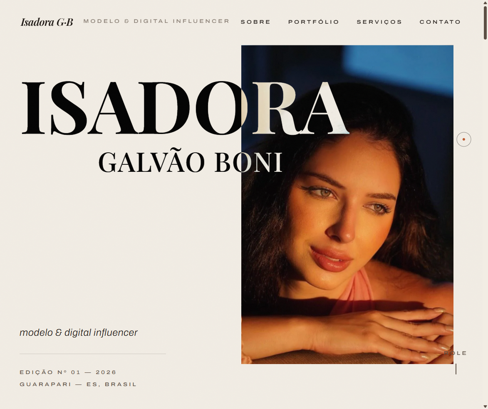

# 📖 Portfólio Editorial — Isadora Galvão Boni

<div align="center">
  
  [](https://isadoragboni.netlify.app/)
  [](https://react.dev/)
  [](https://tailwindcss.com/)
  [](https://vite.dev/)
  [](https://www.typescriptlang.org/)
  [](https://gsap.com/)

  <p align="center">
    <strong>Um portfólio interativo de alta-costura desenvolvido como uma revista de moda viva para a modelo & digital influencer Isadora Galvão Boni (Guarapari — ES).</strong>
  </p>

  <h4>
    <a href="https://isadoragboni.netlify.app/">Visualizar Projeto Online ↗</a>
  </h4>

  

</div>

---

## 🎨 Conceito Visual & Design System

Inspirado nas grandes revistas e editoriais de moda clássicos, o design foi concebido como uma **edição de revista impressa viva**, unindo a sofisticação da mídia física com a fluidez do meio digital.

*   **Paleta de Cores:**
    *   `Bone Paper` (Papel Pólen/Osso): Fundo suave que simula a textura de papel impresso de alta qualidade.
    *   `Espresso Ink` (Tinta Café Escuro): Usado na tipografia e elementos de contorno, oferecendo um contraste mais sofisticado e menos agressivo que o preto puro.
    *   `Terracotta Accents` (Terracota): Tons terrosos para realces, botões e interações.
*   **Tipografia:**
    *   **Playfair Display:** Uma fonte serifada de display elegante, perfeita para títulos e cabeçalhos editoriais.
    *   **Archivo:** Um sistema sans-serif grotesco moderno, garantindo legibilidade e estrutura limpa para o corpo de texto.
*   **Grão Analógico:** Um sutil filtro de ruído/grain overlay cobre a tela para simular a textura tátil do papel impresso.

---

## ✨ Recursos & Funcionalidades

- 💧 **Hero Canvas WebGL (Liquid Displacement):** Um plano interativo renderizado com React Three Fiber e Drei, utilizando um shader GLSL personalizado de deslocamento líquido. Ele reage ao movimento do mouse com efeito de ondulação (*mouse ripple*) e dispersão cromática (*chromatic fringing*).
- 📜 **Scroll Suave Editorial:** Scroll ultra fluido proporcionado por Lenis, integrado ao ticker global do GSAP para sincronização perfeita de taxas de quadros.
- 🖼️ **Galeria Horizontal Pincada:** Seção de portfólio onde a rolagem vertical se transforma em uma transição horizontal fluida (*pinned horizontal gallery*), com efeitos de paralaxe nas fotos e revelações em camadas.
- ✍️ **Revelação de Texto Editorial (`useEditorialReveal`):** Efeitos de revelação de títulos e parágrafos mascarados por linha/palavra, gerados via SplitType e GSAP ScrollTrigger para uma transição suave de entrada.
- 📂 **Sanfona de Serviços Dinâmica:** Acordeão interativo construído com Framer Motion, permitindo ver os pacotes de serviços (provador, ensaio, UGC, etc.) de forma elegante e limpa.
- 🔍 **Lightbox de Mídia:** Visualização de fotos em tela cheia com alta resolução por meio de um wrapper Radix Dialog estilizado.
- ⚡ **Otimização Extrema de Imagens:** As fotos foram extraídas e otimizadas em formato WebP responsivo de alta qualidade (com versões originais e reduzidas de 800px) usando scripts em Python.

---

## 🛠️ Tecnologias Utilizadas

### Core
*   [React 19](https://react.dev/) - Biblioteca para construção da interface de usuário
*   [TypeScript](https://www.typescriptlang.org/) - Tipagem estática
*   [Vite 8](https://vite.dev/) - Ferramenta de build rápida e moderna
*   [Tailwind CSS v4](https://tailwindcss.com/) - Framework utilitário de CSS com o novo compilador rust

### Animações & 3D
*   [GSAP (GreenSock Animation Platform)](https://gsap.com/) + [ScrollTrigger](https://gsap.com/docs/v3/Plugins/ScrollTrigger/) - Controle refinado de animações ligadas ao scroll
*   [React Three Fiber](https://r3f.docs.pmnd.rs/) - Renderização WebGL em React
*   [React Three Drei](https://github.com/pmndrs/drei) - Utilitários e helpers para R3F
*   [Three.js](https://threejs.org/) - Engine 3D básica
*   [Framer Motion](https://www.framer.com/motion/) - Animações de interface e transições de estado
*   [Lenis Scroll](https://lenis.darkroom.engineering/) - Engine para rolagem suave
*   [SplitType](https://github.com/lucasyahl/split-type) - Divisão de blocos de texto em caracteres, palavras e linhas

### Componentes Primitivos
*   [Radix UI Dialog](https://www.radix-ui.com/primitives/docs/components/dialog) - Janela de lightbox com foco em acessibilidade

---

## 📂 Estrutura de Diretórios

```
src/
├── components/
│   ├── chrome/       # Elementos estruturais e overlays (Preloader, Navbar, Cursor, GrainOverlay, Marquee)
│   ├── providers/    # Provedores de contexto (Lenis SmoothScroll e LenisContext)
│   ├── sections/     # Seções da página (Hero, Sobre, Portfolio, Servicos, Contato)
│   ├── ui/           # Primitivas reutilizáveis (ex: Dialog / Lightbox)
│   └── webgl/        # Componentes do Canvas 3D (HeroCanvas, shaders GLSL personalizados)
├── data/
│   └── site.ts       # Centralização de dados (copys, links de contato, fotos, serviços e preços)
├── hooks/            # Hooks customizados (useEditorialReveal, usePrefersReducedMotion)
├── lib/
│   └── gsap.ts       # Configuração global e registro de plugins do GSAP
├── index.css         # Configuração dos tokens do Tailwind v4 (@theme) e estilos globais
└── main.tsx          # Ponto de entrada do React
scripts/              # Utilitários de automação em Python (conversão e otimização de imagens)
public/
└── images/           # Imagens otimizadas em formato WebP
```

---

## ⚡ Acessibilidade & Performance

O portfólio foi otimizado sob regras rígidas de desempenho e conformidade de UX:

*   ♿ **Respeito às Preferências de Movimento (`prefers-reduced-motion`):** Caso o usuário tenha a opção de animações reduzidas ativada no sistema operacional, o site desativa automaticamente a rolagem horizontal pinned, desliga o canvas WebGL e exibe um layout estático linear e limpo.
*   🚀 **Carregamento Otimizado da Hero (LCP):** O WebGL Canvas é carregado em uma chunk separada (*code-split* e *lazy loaded*). Enquanto ele carrega, uma imagem estática idêntica em alta resolução é exibida para garantir um ótimo LCP (Largest Contentful Paint).
*   📱 **Cursor customizado contextual:** O cursor estético customizado só é instanciado em dispositivos com ponteiro fino (mouse/trackpad), evitando bugs e consumo desnecessário de CPU em telas sensíveis ao toque.
*   📐 **Cumulative Layout Shift (CLS) Nulo:** Todas as imagens possuem dimensões fixadas no código para que o browser reserve o espaço correto antes do download terminar. Imagens abaixo da dobra utilizam `loading="lazy"`.

---

## 🚀 Como Rodar o Projeto Localmente

Certifique-se de ter o [Node.js](https://nodejs.org/) instalado. Recomendamos o uso do `pnpm` como gerenciador de pacotes.

1. **Clone o repositório:**
   ```bash
   git clone https://github.com/Marcus-Boni/Sister-s-Portofolio.git
   cd Sister-s-Portofolio
   ```

2. **Instale as dependências:**
   ```bash
   pnpm install
   ```

3. **Inicie o servidor de desenvolvimento:**
   ```bash
   pnpm dev
   ```
   *O site estará disponível localmente em `http://localhost:5173`*

4. **Para gerar a build de produção:**
   ```bash
   pnpm build
   ```

---

## 📝 Como Atualizar o Conteúdo (Mídia Kit)

Todo o conteúdo dinâmico do portfólio (textos, preços dos pacotes, fotos e redes sociais) está centralizado em um único arquivo: **[`src/data/site.ts`](src/data/site.ts)**.

### 1. Atualizar Imagens da Galeria
1. Adicione a foto otimizada em formato `.webp` na pasta `public/images/`.
2. Adicione a versão menor para thumbnails (com largura máxima de 800px e sufixo `-800.webp`).
3. Abra o arquivo `src/data/site.ts` e adicione o objeto correspondente no array `photos`:
   ```typescript
   {
     src: '/images/nome-da-foto.webp',
     small: '/images/nome-da-foto-800.webp',
     alt: 'Descrição acessível da imagem para leitores de tela',
     category: 'Editorial / Moda',
     title: 'Título da Foto',
     width: 1064,  // Largura original da imagem
     height: 1600, // Altura original da imagem
   }
   ```

### 2. Atualizar Preços e Serviços
Edite a constante `services` em `site.ts`. Cada item possui a estrutura de título, descrição curta (`blurb`), preço inicial (`fromPrice`) e a lista detalhada de entregáveis (`items`).

### 3. Redes Sociais e Contatos
Edite a constante `contact` em `site.ts` para alterar links de Whatsapp, Instagram, E-mail ou endereço físico.

---

## 🤝 Contato & Links de Produção

*   **Instagram:** [@isadora_gboni](https://www.instagram.com/isadora_gboni)
*   **E-mail:** [isadoragbonita@gmail.com](mailto:isadoragbonita@gmail.com)
*   **Whatsapp:** [+55 27 99958-5918](https://wa.me/5527999585918)
*   **Deploy Original:** [isadoragboni.netlify.app](https://isadoragboni.netlify.app/)
*   **Desenvolvido por:** [Marcus Boni](https://github.com/Marcus-Boni)

---
<p align="center">Desenvolvido com carinho para destacar a beleza e profissionalismo de Isadora Galvão Boni. ✨</p>
